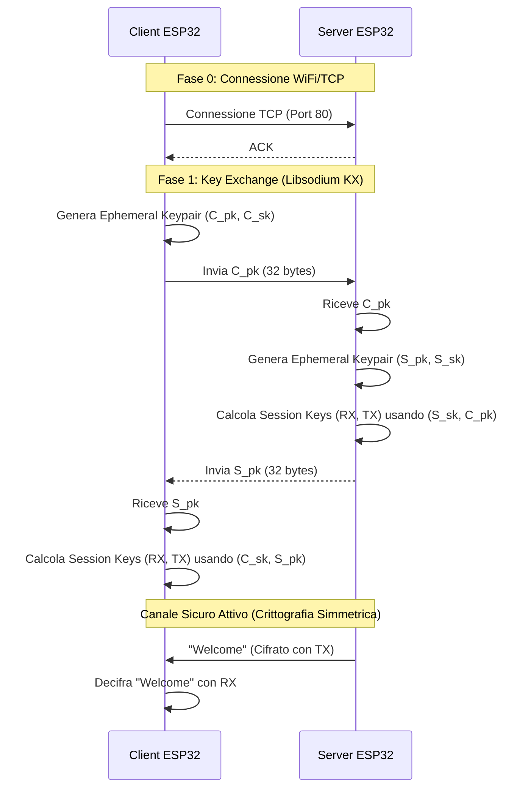

# Diagramma di Sequenza: Key Exchange & Create

## 1. Instaurazione Canale Sicuro (Handshake)
Questo diagramma mostra come Client e Server scambiano le chiavi effimere per creare una sessione cifrata (modello Diffie-Hellman/Key Exchange), prima ancora che l'utente si autentichi.



---

## 2. Creazione Nuovo Articolo (CREATE)
Questo diagramma assume che l'utente sia già autenticato (Session State = LOGGED_IN).

```mermaid
sequenceDiagram
    participant U as User (Autenticato)
    participant C as Client ESP32
    participant S as Server ESP32
    participant SD as Server SD Card

    Note over U, C: Utente loggato e Menu visibile
    U->>C: Input "NEW ENTRY A1 50"
    
    C->>C: Cifra comando con SessionKey
    C->>S: Invia Cifrato [Nonce + Ciphertext]
    
    activate S
    S->>S: Decifra comando
    S->>S: Validazione (Nome alfanumerico, Qty >= 0)
    
    S->>SD: Leggi warehouse.txt
    SD-->>S: Lista Articoli
    S->>S: Verifica: Esiste già "A1"?
    
    alt Articolo già presente
        S-->>C: "Error: Exists" (Cifrato)
        C->>U: Mostra Errore
    else Nuovo Articolo
        S->>S: Cifra riga "A1;50" con StorageKey
        S->>SD: Append riga cifrata
        SD-->>S: OK
        
        S-->>C: "New Entry Added" (Cifrato) + Menu aggiornato
        C->>U: Mostra Successo
    end
    deactivate S
```
