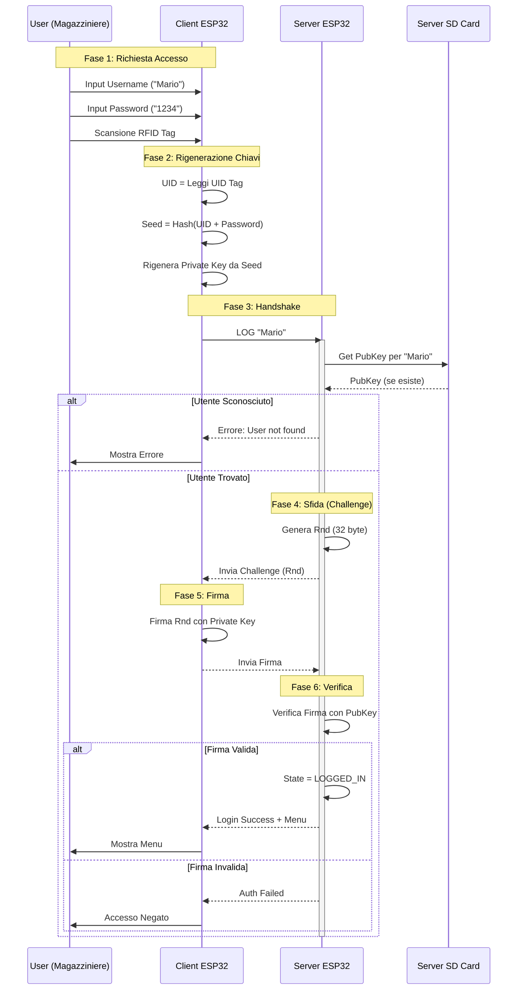

# Diagramma di Sequenza: Login Utente (Challenge-Response)

Questo diagramma illustra il flusso di autenticazione sicura. Il sistema utilizza un approccio **Zero-Knowledge Proof (ZKP)**: il server non conosce la password né la chiave privata dell'utente, ma verifica la sua identità tramite una firma digitale su una sfida casuale (Challenge).

